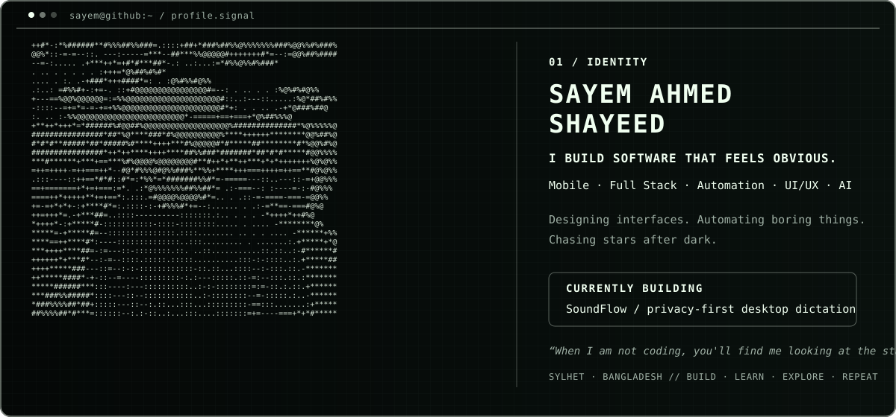
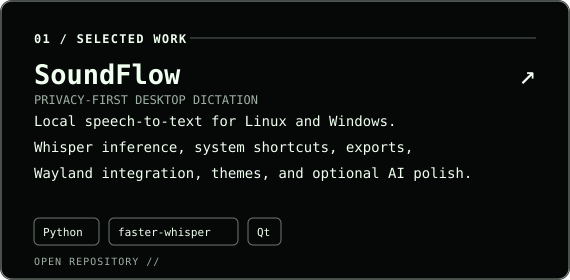
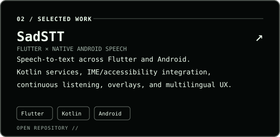
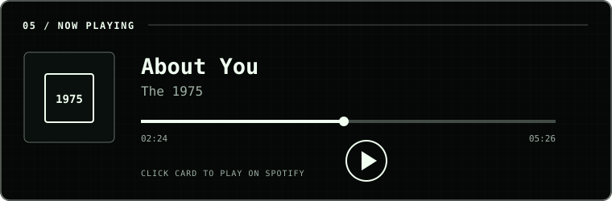
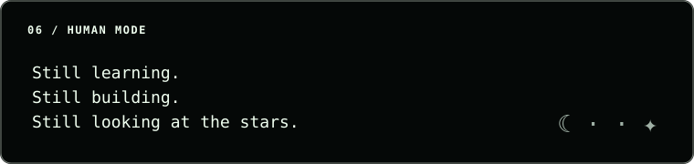

<!--
  SAYEM AHMED SHAYEED — GitHub Profile README
  Visual system: GitAscii-inspired terminal/editorial layout
  Accent: #F0FFF0 (Honeydew / cream white)
-->

  

  

  

<!-- ========================= SELECTED WORK ========================= -->

<table width="100%">
  <tr>
    <td width="50%" valign="top">
      
    </td>
    <td width="50%" valign="top">
      
    </td>
  </tr>
</table>

<code>EXPLORE ALL REPOSITORIES →</code> <a href="https://github.com/Sayem-Ahmed-Shayeed?tab=repositories">github.com/Sayem-Ahmed-Shayeed</a>

<!-- ========================= GITHUB SIGNAL ========================= -->

<h3><code>03 / GITHUB SIGNAL</code></h3>

  

  

<!-- ========================= TECH STACK ========================= -->

<h3><code>04 / TECH STACK</code></h3>

  
  
  

<table width="100%">
  <tr>
    <td width="25%" valign="top"><strong><code>MOBILE</code></strong> Flutter Dart Android Kotlin</td>
    <td width="25%" valign="top"><strong><code>AI / ML</code></strong> Python faster-whisper Deep Learning Speech-to-Text</td>
    <td width="25%" valign="top"><strong><code>DATA / BACKEND</code></strong> SQL Supabase APIs Automation</td>
    <td width="25%" valign="top"><strong><code>PRODUCT</code></strong> UI/UX Figma Git / GitHub VS Code</td>
  </tr>
</table>

<!-- ========================= PERSONAL SIGNAL ========================= -->

<table width="100%">
  <tr>
    <td width="70%" valign="top">
      
    </td>
    <td width="30%" align="center" valign="middle">
      
       <code>personal.signal</code>
    </td>
  </tr>
</table>

<table width="100%">
  <tr>
    <td width="76%" valign="top">
      
    </td>
    <td width="24%" align="center" valign="middle">
      
       <code>loading next idea...</code>
    </td>
  </tr>
</table>

<!-- ========================= CONNECT ========================= -->

<h3><code>07 / CONNECT</code></h3>

  <a href="https://www.linkedin.com/in/sayem-ahmed-65aa012bb"><code>[ LINKEDIN ]</code></a>
  &nbsp;&nbsp;·&nbsp;&nbsp;
  <a href="https://codeforces.com/profile/op_vimdhayak"><code>[ CODEFORCES ]</code></a>
  &nbsp;&nbsp;·&nbsp;&nbsp;
  <a href="https://www.instagram.com/sha__weed"><code>[ INSTAGRAM ]</code></a>
  &nbsp;&nbsp;·&nbsp;&nbsp;
  <a href="https://github.com/Sayem-Ahmed-Shayeed"><code>[ GITHUB ]</code></a>

<code>Better tools. A kinder internet. A more curious me.</code>

  

