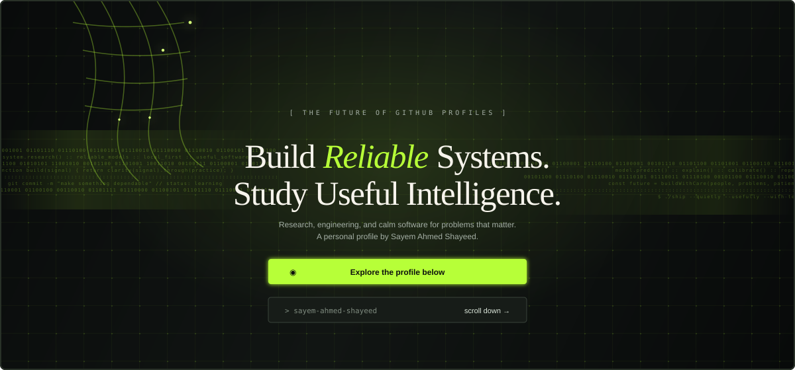

  
  
  
  

 

> I build practical software and study reliable machine learning systems for healthcare, agriculture, language, and resilient infrastructure.

## Signal

| | |
| --- | --- |
| **Role** | Undergraduate Research Assistant at [DeepNetLab](https://deepnetlab.com/team) |
| **Study** | B.Sc. in Computer Science & Engineering at [Leading University](https://lus.ac.bd/) |
| **Location** | Sylhet, Bangladesh |
| **Availability** | Open to research opportunities, scholarships, and meaningful collaborations |

## What I work on

- Machine learning and deep learning systems
- Computer vision and medical imaging
- Explainable and interpretable AI
- NLP and mental-health text analysis
- Agriculture AI and Bangladeshi datasets
- Flutter mobile products and privacy-first desktop tools

## Research desk

### Reliable Dental Radiograph Diagnosis via Calibrated Hybrid Representation Learning

Published as a poster at the **6th Muslims in ML (MusIML) Workshop at ICML 2026**. The work combines deep feature extraction, classical machine learning, calibration, and Grad-CAM interpretability for multi-class dental radiograph diagnosis.

[OpenReview](https://openreview.net/forum?id=Ax5nIzhpt5) · [Google Scholar](https://scholar.google.com/citations?view_op=view_citation&hl=en&user=D57iaqwAAAAJ&citation_for_view=D57iaqwAAAAJ:u-x6o8ySG0sC)

### BongoFishX

**BongoFishX: A Proposed Dataset and its Evaluation for Bangladeshi Fish Species Detection Using Deep Learning Models and Explainable AI** — published at **IEEE QPAIN 2026**.

[Google Scholar](https://scholar.google.com/citations?user=D57iaqwAAAAJ&hl=en)

### MentalDistress dataset

A manually curated and annotated English text dataset for multi-class mental-health emotion detection. **Version 2** is available on Mendeley Data with **10,100 samples**.

[Dataset](https://data.mendeley.com/datasets/b42wr437hg/2) · [DOI](https://doi.org/10.17632/b42wr437hg.2)

## Things I’m building

<table>
<tr>
<td width="50%" valign="top">

### [SoundFlow](https://github.com/Sayem-Ahmed-Shayeed/SoundFlow)

Privacy-first desktop dictation for Linux and Windows. Speech is transcribed locally with faster-whisper, with optional LLM cleanup.

`Python` `Qt` `faster-whisper`

</td>
<td width="50%" valign="top">

### [UniNest](https://github.com/Sayem-Ahmed-Shayeed/UniNest)

An academic companion for class sessions, routines, results, notes, resources, assignments, and campus information.

`Flutter` `Dart` `Mobile`

</td>
</tr>
<tr>
<td width="50%" valign="top">

### [Digital Delta](https://github.com/Sayem-Ahmed-Shayeed/hackathon_project)

An offline-first disaster-response and logistics prototype built for HackFusion 2026.

`Flutter` `Firebase` `ONNX`

</td>
<td width="50%" valign="top">

### [Investify](https://github.com/Sayem-Ahmed-Shayeed/Investify)

A founder and investor mobile platform inspired by the Shark Tank experience.

`Flutter` `Dart` `Firebase`

</td>
</tr>
</table>

## Technology

 

`Python` `C` `C++` `Java` `Dart` `Flutter` `Firebase` `Supabase` `MySQL` `Qt` `REST APIs` `ONNX`

## Education

- **B.Sc. in Computer Science & Engineering** — Leading University, Sylhet · Expected February 2027 · CGPA **3.92 / 4.00**
- **Higher Secondary Certificate (HSC)** — MC College, Sylhet · GPA **5.00**
- **Secondary School Certificate (SSC)** — Pagla Govt. Model High School, Sunamganj · GPA **5.00**
- **Junior School Certificate (JSC)** — Pagla Govt. Model High School, Sunamganj · GPA **5.00**

## Competitive programming

<a href="https://codeforces.com/profile/op_vimdhayak">Codeforces</a> · <a href="https://leetcode.com/u/euphori_A/">LeetCode</a>

## GitHub telemetry

<picture>
  <source media="(prefers-color-scheme: dark)" srcset="https://pixel-profile.vercel.app/api/github-stats?username=Sayem-Ahmed-Shayeed&theme=blue_chill&screen_effect=true&hide=avatar">
  <source media="(prefers-color-scheme: light)" srcset="https://pixel-profile.vercel.app/api/github-stats?username=Sayem-Ahmed-Shayeed&theme=summer&pixelate_avatar=false">
  
</picture>

## Milestones

- **HackFusion 2026** participant — IEEE Computer Society LU SB Chapter
- **10th place**, BAIUST Junior IUPC 2024 — Individual standings
- **Coder of the Batch** recognition
- **75% merit-based tuition waiver** at Leading University

## A small note

I like software that feels calm to use: clear interfaces, useful defaults, local-first behavior where it matters, and research that can be explained to the people who depend on it.

If you are working on a thoughtful research problem or a useful product, [send me an email](mailto:shayeedahmed2@gmail.com).

 

